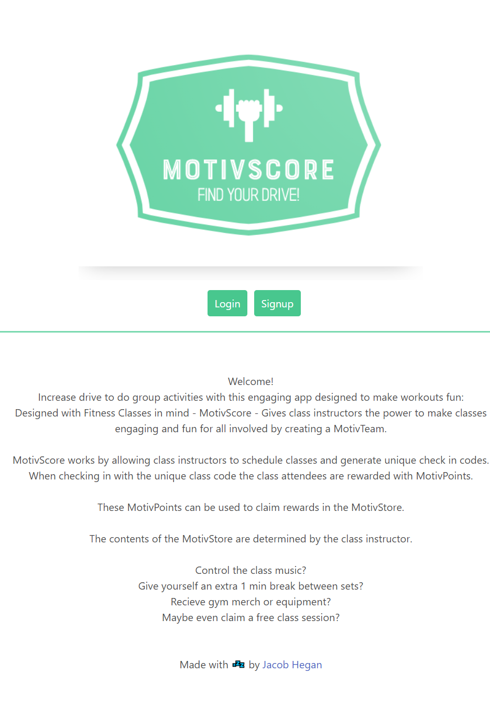

# Project 3 - MotivScore

by Jacob Hegan

UWA Full-Flex Bootcamp February 2021

[Heroku Link](https://p3-motivscore.herokuapp.com/)

[GitHub Repository](https://github.com/heganjr/motivescore-p3)

[Presentation Slides](https://www.canva.com/design/DAEnPY9icow/Xg2L_cdYvPB8W0h2kIgQaA/edit)

---

[](https://choosealicense.com/licenses/mit/)

---

## Description

MotivScore - an app used to encourage gym goers to maintain that attendance and get that workout

## Table of Contents

- [Installation](#installation)
- [Usage](#usage)
- [Screenshots](#screenshot)
- [Technologies](#technologies)
- [Future Deployments](#future-deployments)
- [How To Contribute](#how-to-contribute)
- [Credits](#credits)
- [License](#license)

## Installation

If cloning the repo locally, within the root of the directory:

npm i

- to install all dependencies found in package.json within both app/client and app/server

npm run seed

- to push seed data to the MongoDB database

npm start

- to launch the graphql server at https://localhost:3001

npm run develop

- to launch graphql and create-react-app concurrently

... otherwise operate the app through the heroku link above

## Usage

```md
AS A class instructor wanting to encourage clients to workout
I WANT an easy class scheduler app that generates check-in codes
SO THAT when my clients attend scheduled classes they are rewarded with digital currency
THEN WHEN they accumulate enough currency, they can claim rewards and spend that currency.
```

---

```md
GIVEN a class scheduler site
WHEN I schedule classes
THEN I am presented with class details and recieve an unique check in code
WHEN THEY check in with this unique code
THEN THEY receive digital currency determined by the scheduler
WHEN THEY have accumulated enough currency
THEN THEY can claim rewards and spend mentioned currency
AFTER signing up, I can view my profile page
THEN I am able to update my email, username passowrd or delete my account
WHEN I see how much currency I own
THEN I can navigate to a link that allows me to spend this currency
THEN this currency is deducted based on the value of what was purchased.
```

### Screenshot




## How to Contribute

---

Contributions are not possible.

If there are issues you can contact me through my GitHub profile found in the credits below.

I am happy to take on any suggestions and feedback!

---

## Technologies 

Technologies used, app/npm packages:
- concurrently v6.2.0

client/npm packages:
- Apollo Client v3.4.7
- graphql v15.5.1
- jwt-decode v3.1.2
- react (initialised with create-react-app) v17.0.2

server/npm packages:
- Apollo Server Express v2.12.0
- Bcrypt v5.0.0
- dotenv v10.0.0
- express v4.17.1
- graphql v 15.5.1
- jsonwebtoken v8.5.1
- mongoose v5.9.9

---

## Future deployment
Planned to release in future updates:
- Schedule classes
- Generate alphanumeric check in codes
- Generate QR Check in codes
- Launch the currency shop (MotivStore)
- Create and Modify rewards
- Class leaderboards that allow point rewards for final position
- Consecutive attendance point multiplier


## Credits

[hegan.jr](https://github.com/heganjr)

---

## License

[MIT](https://choosealicense.com/licenses/mit/)

MIT License

Copyright (c) [2021] [Jacob Hegan]

Permission is hereby granted, free of charge, to any person obtaining a copy
of this software and associated documentation files (the "Software"), to deal
in the Software without restriction, including without limitation the rights
to use, copy, modify, merge, publish, distribute, sublicense, and/or sell
copies of the Software, and to permit persons to whom the Software is
furnished to do so, subject to the following conditions:

The above copyright notice and this permission notice shall be included in all
copies or substantial portions of the Software.

THE SOFTWARE IS PROVIDED "AS IS", WITHOUT WARRANTY OF ANY KIND, EXPRESS OR
IMPLIED, INCLUDING BUT NOT LIMITED TO THE WARRANTIES OF MERCHANTABILITY,
FITNESS FOR A PARTICULAR PURPOSE AND NONINFRINGEMENT. IN NO EVENT SHALL THE
AUTHORS OR COPYRIGHT HOLDERS BE LIABLE FOR ANY CLAIM, DAMAGES OR OTHER
LIABILITY, WHETHER IN AN ACTION OF CONTRACT, TORT OR OTHERWISE, ARISING FROM,
OUT OF OR IN CONNECTION WITH THE SOFTWARE OR THE USE OR OTHER DEALINGS IN THE
SOFTWARE.

---

END
